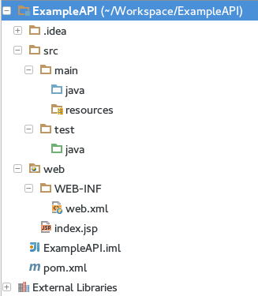

Instalación
============

## Descargar Tomcat 7
Nos descargamos de la página web de tomcat la versión 7 en zip.

## Crear un nuevo proyecto

Dentro de IntelliJ seleccionamos Java EE -> RESTful Web Service con los siguientes parametros.

- Project SDK: 1.8
- Java EE version: Java EE 7
- Application Server: NEW -> Seleccionamos la carpeta del tomcat y le damos como nombre Tomcat

Y marcamos **Set up library later**, en caso de que no nos aparezca seleccionamos **Download** y en *configure* deseleccionamos todo.

## Añadir framework de Maven

Hacemos clic derecho sobre el nombre del proyecto y le damos a **Add Frameowrk Support...** y elegimos `Maven`.

Cuando se nos despliegue en la ventana el fichero .xml tendremos que especificarle el nombre del artefacto que vamos a usar:

```xml
<!-- file pom.xml -->
<?xml version="1.0" encoding="UTF-8"?>
<project xmlns="http://maven.apache.org/POM/4.0.0"
         xmlns:xsi="http://www.w3.org/2001/XMLSchema-instance"
         xsi:schemaLocation="http://maven.apache.org/POM/4.0.0 http://maven.apache.org/xsd/maven-4.0.0.xsd">
    <modelVersion>4.0.0</modelVersion>

    <groupId>DS</groupId>
    <artifactId>PharmacyS</artifactId>
    <version>1.0-SNAPSHOT</version>

</project>
```

Cuando añadimos maven nos ofrece la opción de habilitar la auto-importación de paquetes, es muy recomendable activarla.

## Añadiendo Framework de Aplicación Web

Al igual que con maven nos dirigimos a **Add Framework Support...** y en este caso elegimos `Web Application` y tendremos una estructura semejante a esta.



## Añadir Jersey

Para añadir Jersey lo añadiremos desde `Apache Maven` y para ello pondremos dentro del archivo `pom.xml` lo siguiente:

```xml
<project xmlns="http://maven.apache.org/POM/4.0.0">
	<!-- ... -->
	<dependencies>
		<dependency>
			<groupId>com.sun.jersey</groupId>
			<artifactId>jersey-bundle</artifactId>
			<version>1.19.1</version>
		</dependency>
	</dependencies>

</project>
```

Ahora maven resolverá la dependencia y obtenedremos los .jar de jersey que necesitamos.

## Configurar el servidor web

Si no añadimos el servidor de tomcat lo podremos añadir en la flecha que se puede desplegar a la izquierda de la flecha verde de Run seleccionando **Edit Configurations...**.

Ahora lo que tenemos que hacer es indicarle al servidor de tomcat en la parte de **Deployment** que añada un WAR y le damos a OK.

## Configurar Servlet

```xml
<!-- File web/WEB-INF/web.xml -->
<?xml version="1.0" encoding="UTF-8"?>
<web-app xmlns="http://xmlns.jcp.org/xml/ns/javaee"
         xmlns:xsi="http://www.w3.org/2001/XMLSchema-instance"
         xsi:schemaLocation="http://xmlns.jcp.org/xml/ns/javaee http://xmlns.jcp.org/xml/ns/javaee/web-app_3_1.xsd"
         version="3.1">
    <servlet>
        <servlet-name>PharmacyS</servlet-name>
        <servlet-class>com.sun.jersey.spi.container.servlet.ServletContainer</servlet-class>

        <init-param>
            <param-name>com.sun.jersey.config.property.packages</param-name>
            <param-value>example</param-value>
        </init-param>

        <init-param>
            <param-name>com.sun.jersey.api.json.POJOMappingFeature</param-name>
            <param-value>true</param-value>
        </init-param>
    </servlet>

    <servlet-mapping>
        <servlet-name>PharmacyS</servlet-name>
        <url-pattern>/*</url-pattern>
    </servlet-mapping>
</web-app>
```

Ahora nos falta indicarle a Tomcat donde están nuestros archivos de configuración, para ello nos vamos a **File > Project Structure > Artifacts** y en la pestaña de **Aviable Elements** seleccionamos todos y pulsamos clic derecho y pulsamos en la opción **Put in default Location**.

Ejecutamos la aplicación y accedemos a `http://localhost:8080/hello`.

## Referencias

- [Intellij Jersey Web Service](https://medium.com/@jamsesso/starting-out-with-jersey-apache-tomcat-using-intellij-6338d93ffd40#.rydj2pegm)
- [Conector BD JAVA: Ejemplo de Derby](http://www.informit.com/articles/article.aspx?p=1671224&seqNum=2)

Como conectores de BD también podemos encontrar:

- JPA
- Hibernate
- Derby

Pero nos decantamos por `Derby` por el uso del proprocesador ya que poniendo `@KEYWORD` no es necesario definir los mapeos de datos en ficheros xml externos, y comprueba el estado de los objetos gracias a su EntityManager para saber que acción realizar
